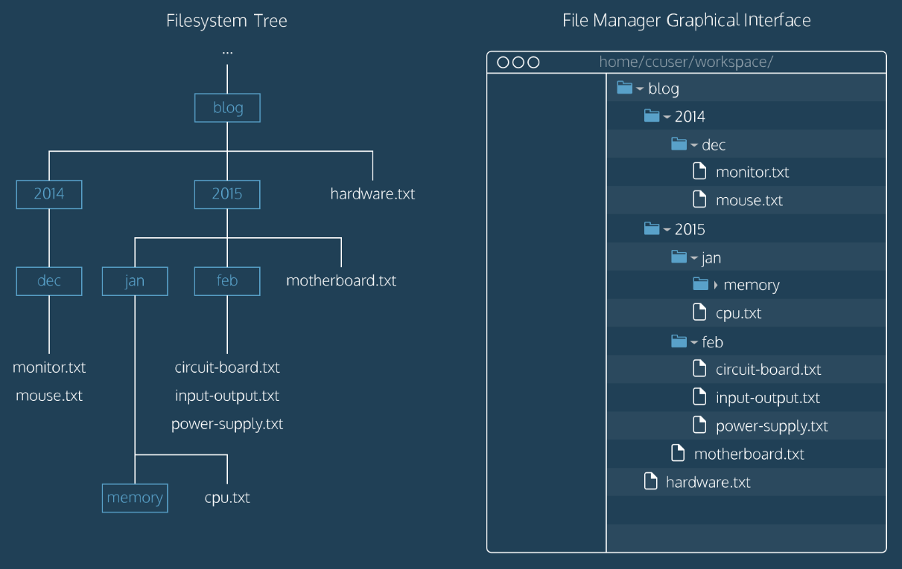

# Navigare nel File System

## Cos'è Bash?
[Bash](https://en.wikipedia.org/wiki/Bash_(Unix_shell)) sta per **Bourne-Again SHell**, è una [CLI](https://it.wikipedia.org/wiki/Interfaccia_a_riga_di_comando) che è stata creata più di 70 anni fa da **Brian Fox** come sostituto gratuito ed open source della Bourne Shell. Una [shell](https://it.wikipedia.org/wiki/Shell_(informatica)) è uno specifico tipo di CLI. Bash è la shell di default dei sistemi [UNIX](https://it.wikipedia.org/wiki/Unix) (che comprendono linux e macOS).

## Il tuo primo comando

La linea di comando è un interfaccia testuale al tuo computer. È un programma che riceve comandi, che vengono passati al [OS](https://it.wikipedia.org/wiki/Sistema_operativo).

Dalla command line, si può navigare tra i files e le cartelle del computer, come si può fare con un esplora risorse grafico, la differenza è che la command line è **text-based**.

Il vantaggio che si ha utilizzando il terminale è la sua potenza. Si possono far girare eseguibili e scrivere script per **automatizzare** azioni ripetute spesso, combinando semplici comandi è possibile risolvere problemi complessi.

### $ ls
``` sh{1,3,5,9}
$ ls # Comando per vedere la lista dei files presenti nella cartella attuale
# file1 file2 directory1
$ ls -a # Visualizza anche i files nascosti (che iniziano sempre con un '.', detti dot-files)
# . .. file1 file2 directory1
$ ls -t # Visualizza più dettagli, come i diritti di scrittura, la data di creazione, l'autore...
# drwxr-xr-x  2 handgull handgull 4096 feb  4 12:24 file1
# drwxr-xr-x  3 handgull handgull 4096 feb  4 11:44 file2
# drwxr-xr-x  4 handgull handgull 4096 feb  3 14:42 directory1
$ ls -alt # Si possono combinare tutti i parametri
```
:::tip
La **shell prompt** appare quando il terminale è pronto a ricevere gli input, può cambiare aspetto differente da terminale a terminale, ed è personalizzabile.<br>
(vedi ~/.bashrc e $PS1 nella sezione linux).<br>
l'opzione `-t` ordina la lista risultante da quello modificato più recentemente.
:::

## Filesystem

Un filesystem organizza i files e le directories(cartelle) in una **struttura ad albero**:



1. La prima cartella del FS(filesystem) è la **root directory**, ed è la cartella da cui derivano tutte le cartelle e file del FS.

2. Ogni cartella padre può **contenere** più files/directory. Ad esempio nell'immagine sopra `blog/` è padre di `2014/`, `2015/` e `hardware.txt`

### $ pwd
``` sh
$ pwd # Comando per vedere il path in cui ci si trova, ovvero la cartella ed i suo percorso
> /home/handgull
```
:::tip
**pwd** = Print working directory. Nell'esempio sopra la Working directory è `handgull`<br>
:::
`ls` e `pwd` sono quindi utili comandi del terminale per capire "dove ci si trova"

### $ cd
``` sh
$ cd <path> # Comando per spostarsi all'interno della cartella
$ cd .. # Comando per spostarsi nella cartella padre
```
:::tip
**cd** = Change direcory. In altre parole con `cd` possiamo cambiare la Working directory.
:::
:::tip
Negli esempi sopra è stato passato un **parametro** al comando cd
:::
### $ mkdir & $ touch
``` sh
$ mkdir <name> # Crea una cartella all'interno della Working directory
$ touch <name> # Crea un file vuoto nella Working directory
```

### Filesystem: esercitazione

[GO!](./exercise-bicycle-world.md)