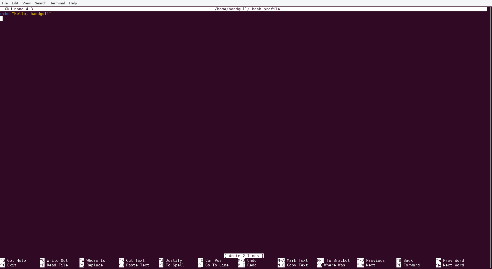
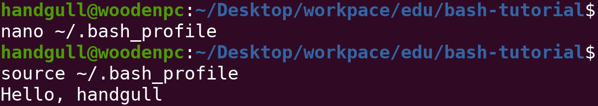
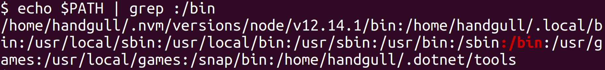

# Environment

We can configure the environment to support the commands and programs we create. This enables us to customize greetings and command aliases, and create variables to share across commands and programs.

Ogni volta che si apre un nuovo terminale viene creata una nuova sessione.<br>
La sessione carica le impostazioni e le preferenze come ad esempio da un file `~/.bashrc`, da un file `~/.bash_profile` ed anche da altre fonti riceviamo, tra le altre cose, degli alias o anche un nostro prompt dei comandi personalizzato, ecc...<br>

L'envinronment può essere configurato in tutto per tutto, permettendoci ad esempio di aggiungere al `PATH` dei nuovi programmi di terze parti, alias o variabili.
> Gli [alias](https://alvinalexander.com/blog/post/linux-unix/create-aliases) non sono altro che metodi alternativi per chiamare un comando.<br>
> ad esempio con `alias search=grep` d'ora in poi grep si chiamerà anche search! (all'interno della sessione a meno che non sia specificato nel file sopra citato)

## nano & .bash_profile
nano è un **editor** di testi completamente text based e minimale, non offre molte funzionalità, ma è comodo per scrivere linee di **configurazione** in giro per il File System.
```sh
nano ~/.bash_profile # apre il file contenente alcune configurazioni di bash
source ~/.bash_profile # Carica le impostazioni contenute nel .bash_profile senza dover chiudere e riaprire il terminale
```
> `~` Identifica il path assoluto per accedere alla home dell'utente della sessione bash.
:::warning
Con `su` si può accedere ad altri utenti dentro la sessione bash, **non è la stessa cosa di cambiare utente** quando si fa il reboot del pc, si parla appunto di un envinronment fine a se stesso, ovvero all'interno del terminale.
:::




Ora all'inizio di ogni sessione comparirà un messaggio di benvenuto

## Le variabili
```sh
# ~/.bash_profile
export USER="handgull"
```
```sh
echo $USER # Stamperà a video "handgull"
```

### Bonus: Pixel-art
Se può interessare ho fatto delle variabili che messe nel `~/.bash_profile` forniscono delle pixel art, clicca [qui](./pixel-art)!

### Variabili di ambiente
Bash ci fornisce alcune variabili già valorizzate, come ad esempio `$PS1` o `'$HOME`:
```sh
echo $PS1 # Stampa il valore della variabile che si occupa della shell prompt
export PS1="$ " # Modifica la shell prompt, CONSIGLIO: da sperimentare da terminale, per modificare solo la sessione corrente
echo $HOME # Stampa il path assoluto associato alla home dell'utente
echo $PATH # Stampa la lista di tutti i PATH degli eseguibili.
env # Stampa a video ogni variabile d'ambiente, con il valore associato
```



> Anche in questo screen si può notare come $PS1 sia stata modificata di valore, portando ad una modifica della shell prompt<br>
> Come potete vedere evidenziato in **rosso** è anche presente il path `/bin`, proviamo a non sottointenderlo:
```sh
/bin/pwd # Lancia il comando pwd specificando il path assoluto, che è implicito grazie a $PATH
```
```sh
# ~/.bash_profile
export PATH=<nuovo_path_assoluto>:$PATH # Aggiunge un path ai PATH degli eseguibili accessibili direttamente da Bash
# NOTA: il carattere : separa i path gli uni dagli altri
```
::: tip
Questo è utile quando ad esempio vi è un eseguibile con path `/directory/eseguibile` e si vuole rendere l'eseguibile **accessibile** da qualunque path specificandone solo il nome (in questo caso "eseguibile")
:::
