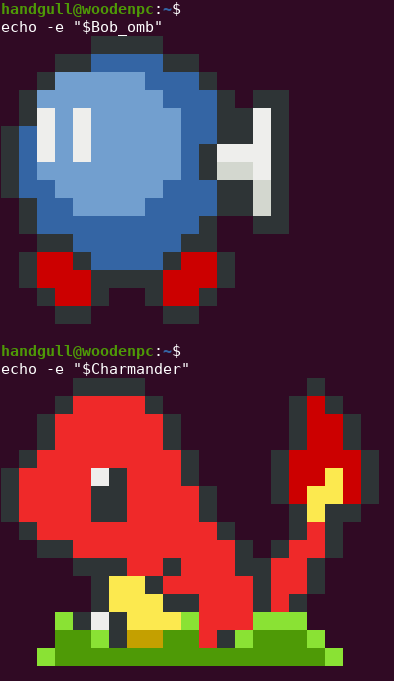

# Charmander e Bob Omb nel terminale
Scarichiamo lo script: [`Download here`](/assets/script.sh)<br>
Copiamo le righe del file nel nostro `~/.bash_profile` e successivamente effettuiamo un refresh della sessione.

## Esercizio! Proviamo ad usare la redirection
Proviamo ad usare la redirection per **APPENDERE** le righe del file scaricato al file `~/.bash_profile`
```sh
cat script.sh >> ~/.bash_profile # Reindirizzamento del contenuto del file (tramite append)
source ~/.bash_profile # Refresh della sessione
```


