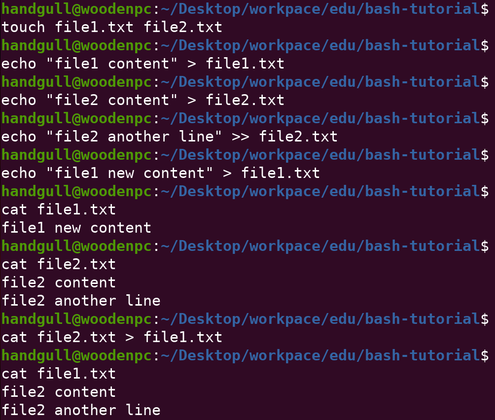
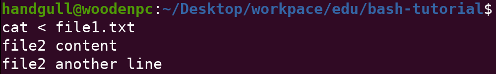
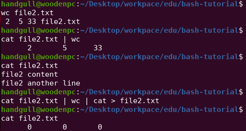
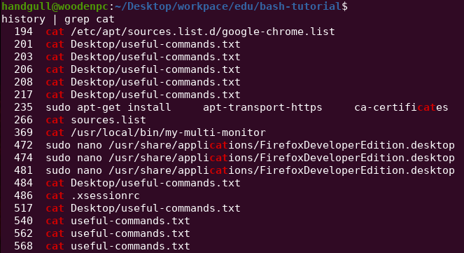

# Reindirizzamento
Fino ad ora abbiamo lanciato comandi nella command line ed abbiamo ricevuto uno stream di output da terminale (in alcuni comandi no, ad esempio con `touch`). Ora ci concentreremo sulla **redirezione** di questi **(I/O)**.<br>

Tramite la redirection possiamo dirigere gli input e gli output di un comando a/da files e programmi; ed anche **connettere più comandi** assieme in una "pipeline".
```sh
$ echo "Hello" # Accetta la stringa "Hello" tramite STDIN e poi la stampa a video tramite STDOUT
$ cat <file> # stampa a video (sempre tramite STDOUT) il contenuto del file
```

## STDIN, STDOUT, ed STDERR
- Standard input, abbreviato come `STDIN`, sono informazioni ricevute in input dal terminale tramite la tastiera o un altro device di input.
- Standard output, abbreviato come `STDOUT`, sono le informazioni mandate in output dopo che un processo è stato eseguito.
- Standard error, abbreviato come `STDERR`, è un messaggio di errore mandato in output dopo il fallimento di un processo.
> Naturalmente tutti e 3 possono essere rediretti nelle maniere descritte più in basso.

### Esempi di redirect:
- Il comando `>` ridirige lo standard **output** ad esempio verso un file. Negli esempi sotto viene utilizzato appunto per salvare delle stringhe all'interno dei files.<br>
- `>>` differisce leggermente, è un append e non una sovrascrizione totale del contenuto.



- `<` direziona lo standard **input** dall'elemento a destra e lo mette nell'elemento a sinistra. In questo caso con una cat il risultato è il medesimo



```sh
$ wc <file> # Word counter, produce sullo standard output un conteggio delle linee, parole e byte che costituiscono uno o più file di testo specificati
$ sort <file> # Stampa a video il contenuto del file, con le righe ordinate alfabeticamente
$ uniq <file> # Stampa a video il contenuto del file senza ripetizioni ADIACENTI tra loro (se una riga è identica alla precedente non la stampa)
$ grep <string> <file> # Stands for “global regular expression print”, stampa ogni riga del file dove è presente la sottostringa specificata
$ sed 's/<string1>/<string2>/g' <file> # Sostituisce le ricorrenze della prima stringa con la seconda all'interno di un file
history # Stampa lo storico dei comandi
```
> `grep -i <file>` rende il comando case-insensitive<br>
> `grep -R <directory>` cerca tra tutti i nomi dei file all'interno della directory e tra le righe dei file le ricorrenze. -R sta per "recursive".<br>
> `grep -Rl <directory>` -l specifica che la ricerca riguarda SOLO i nomi dei file<br>
> Per ogni comando ho utilizzato un file ma come vedremo con il reindirizzamento non è sempre un file il parametro
:::tip
Per altri dettagli sulle **regex** del comando `sed`, clicca [qui](https://www.geeksforgeeks.org/sed-command-in-linux-unix-with-examples/)
:::

- `|` è detta "pipe". La pipe prende lo standard **output** del comando a sinistra, e lo manda come standard **input** del comando sulla destra. In pratica è una redirezione "da comando a comando". 



> I comandi sono particolarmente potenti e versatili quando combinati tra loro

```sh
$ cat lakes.txt | sort > sorted-lakes.txt # Ordina alfabeticamente i laghi e salva il nuovo ordinamento nel file sorted-lakes.txt
$ sort deserts.txt | uniq # Stampa a video i nomi dei deserti ordinati alfabeticamente e senza ripetizioni
$ sort deserts.txt | uniq > uniq-deserts.txt  # Idem ma salva l'output in un file
$ history | grep <string> # Stampa ogni comando eseguito in passato con la sottostringa specificata
```

