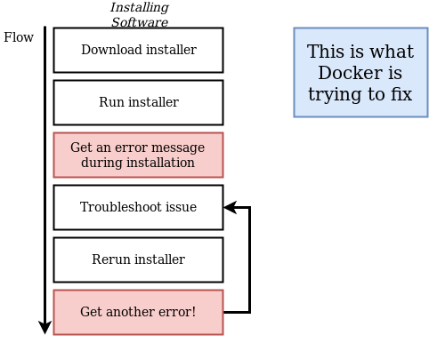
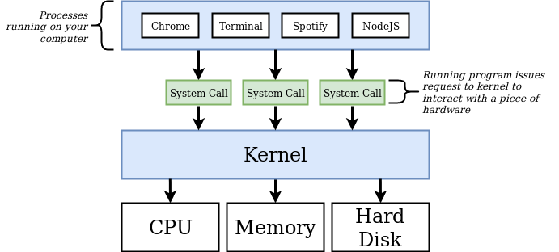
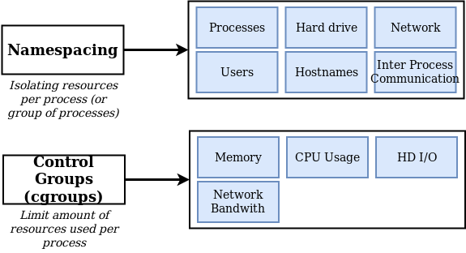
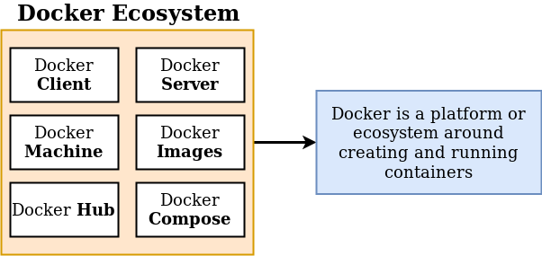
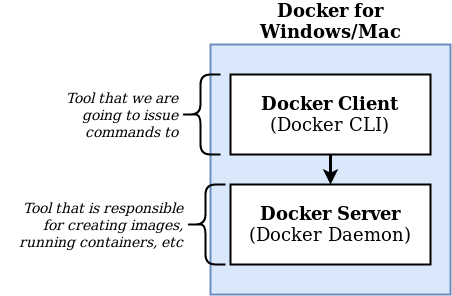
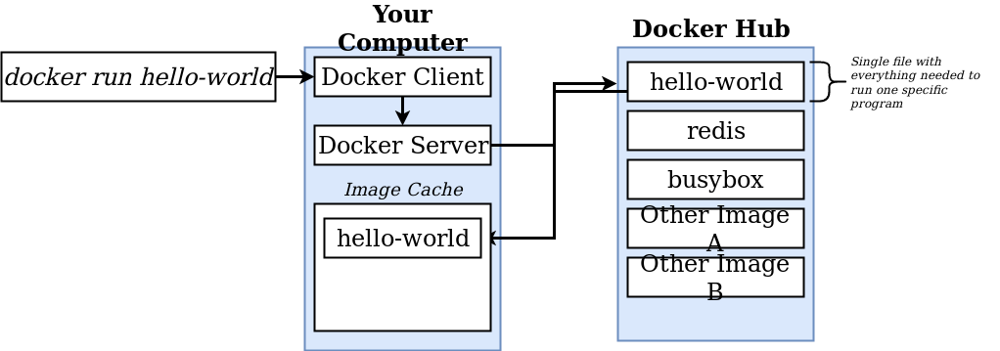
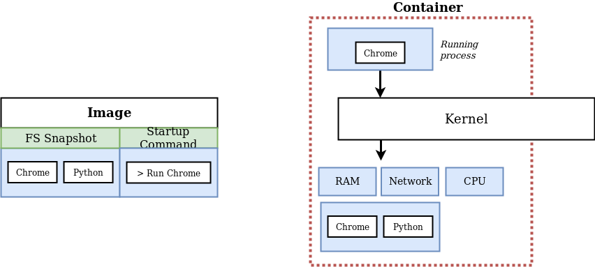
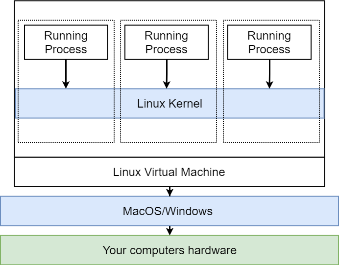

# Alla scoperta di Docker!

## WHY & WHAT: perchè usare docker? Cos'è?
Docker vuole rendere **immediata** l'installazione di un software su qualsiasi macchina senza preoccuparsi delle dipendenze o del setup.
> Il concetto di "container" non è certo stato introdotto da Docker ed esisteva già negli anni 70 (es: linux namespaces, come vedremo pià avanti).



> "Docker is for server applications—Web sites, APIs, messaging solutions and other components that run in the background. You can't run desktop apps in Docker because there's no UI integration between the Docker platform and the Windows host. That rules out running Windows Forms or Windows Presentation Foundation (WPF) apps in containers (although you could use Docker to package and distribute those desktop apps), but Windows Communication Foundation (WCF), .NET console apps and all flavors of ASP.NET are great candidates."
::: tip
In parole semplici: niente app con le [UI](https://it.wikipedia.org/wiki/Interfaccia_utente) nei container
| Applicativo                                                           | Va bene?      |
| --------------------------------------------------------------------- |:-------------:|
| [Redis](https://redis.io/)                                            | Yes           |
| [WPF](https://it.wikipedia.org/wiki/Windows_Presentation_Foundation)  | No            |
| [WCF](https://it.wikipedia.org/wiki/Windows_Communication_Foundation) | Yes           |
:::

### Containers

#### Ma prima... come funziona un OS (Operating System)



> **Kernel**: Layer che fa da [middleware](https://it.wikipedia.org/wiki/Middleware) tra i programmi e le risorse hardware

Un container è un **processo** con delle limitazioni hardware, non è un costrutto fisico:
1. **Name space** = Isola le risorse del processo.
2. **Control Group** = Limita le risorse hardware usate dal processo.



### Ecosistema Docker
Docker è una piattaforma che si compone di tools per la gestione dei **container**.



#### Focus: Docker Client e Docker Server
::: tip
C'è da considerare che **Docker Client = Docker CLI**, tramite la CLI possiamo dire alla docker Hub (Passando per il Docker Server, a.k.a. Daemon) di scaricare una determinata **Docker image** (Vedi [sotto](./#docker-images)), che può essere usata per instanziare un container
:::
- **Docker CLI** = applicativo che da terminale mi aiuta a dare **comandi** al Docker Server.
- **Docker Server** = applicativo che gira in background tramite il quale io faccio tutto ciò che è possibile fare con docker.
``` sh{4}
$ docker version # Comando per poter vedere le versioni di Docker Client/Server ed altre info (come la versione di golang usata da Docker)

$ (sudo) docker run hello-world # Facciamo girare il nostro primo container!
# Se l'immagine non è presente nell'imageCache verrà scaricata
# Questo container stamperà a video un messaggio che spiega il processo fatto da docker per fare girare un container
# ↓
```
Messaggio stampato a video dopo l'esecuzione:
> Hello from Docker!
> This message shows that your installation appears to be working correctly.
>
> To generate this message, Docker took the following steps:
>  1. The Docker client contacted the Docker daemon.
>  2. The Docker daemon pulled the "hello-world" image from the Docker Hub.
>     (amd64)
>  3. The Docker daemon created a new container from that image which runs the
>     executable that produces the output you are currently reading.
>  4. The Docker daemon streamed that output to the Docker client, which sent it
>     to your terminal.





#### Focus: Docker Hub e Docker Images
Il Docker Hub è una repository piena di immagini gratuite e pubbliche, come visto sopra quando non si trova un immagine Docker prova automaticamente a scaricarla da qui.


### Docker images
> Se sei finito qui tramite il link sopra ecco un link per [tornarci](./#focus-docker-client-e-docker-server)

Un'immagine è una rappresentazione binaria, come gli OVA (le immagine delle [VM](https://it.wikipedia.org/wiki/Macchina_virtuale))<br>
All'interno di un'immagine vi è:
1. un **File system Snapshot**, ovvero una "foto" di un [File system](https://it.wikipedia.org/wiki/File_system) da implementare, una specie di copia-incolla di directory e files.
2. uno **Startup Command**, ovvero un comando che si esegue all'avvio del container.

Una volta creato un container a partire da questa immagine il container isolerà una porzione di [Hard Drive](https://it.wikipedia.org/wiki/Disco_rigido) per lui (quindi è come se in quella porzione di HD ci andasse il FS SnapShot).



> Più avanti vedremo anche il concetto di **Immagine custom**

## HOW: Come fa Docker a girare
Docker gira su **Linux** :penguin:. (se si è in ambito windows, ad esempio, docker sfrutta **WSL**)<br> I container usano quindi le funzioni fornite dai sistemi UNIX per isolare le risorse dei processi ecc, per questo è utile conoscere a fondo i sistemi UNIX o almeno argomenti imprescindibili come [chroot, cgroups e namespaces](./chroot-cgroups-namespaces.md).
::: tip
Infatti lanciando il comando sopra citato `docker version` e guardando su che [OS](https://it.wikipedia.org/wiki/Sistema_operativo) stanno girando Server e Client vedremo un sistema linux
:::



> Docker ha performance peggiori su windows, questo sta per essere sistemato in parte con [WSL2](https://docs.microsoft.com/en-us/windows/wsl/wsl2-about).
