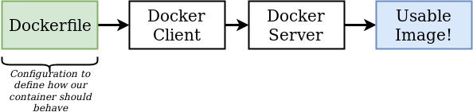
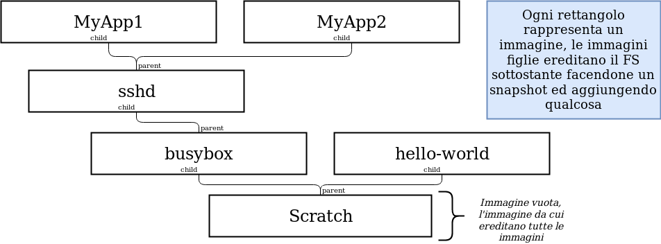
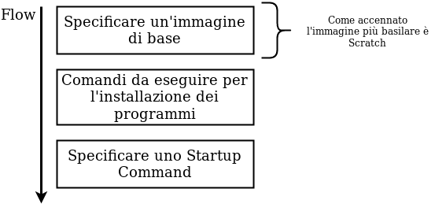
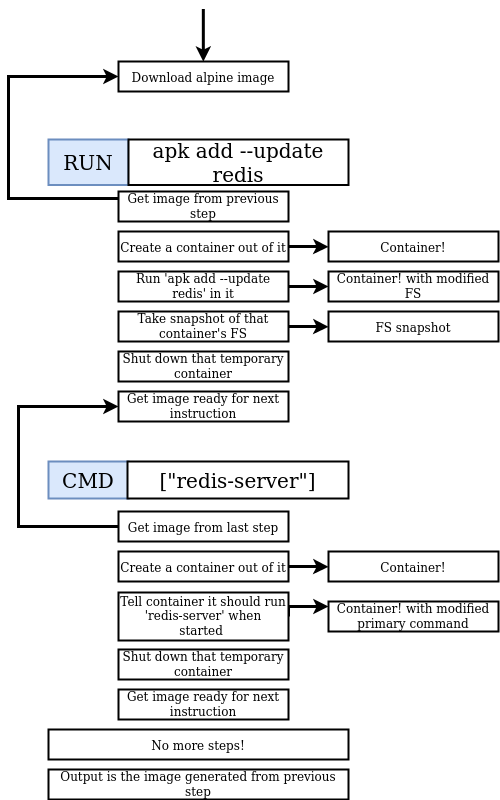

# Immagini custom

## Dockerfiles
Un dockerfile è un **envinronment** descritto in un file di testo, dentro cui si scrivono i **programmi** che compongono la nostra immagine custom ed il **comando iniziale**. 
Fornendo un docker file al Docker Server esso ci restituira un immaggine usabile.

## Image Layers
Le immagini hanno un rapporto **parent-child** (padre-figlio), ovvero un'immagine è creata usandone un altra come **base**. Analizziamone i vantaggi:
- In questo modo è possibile che delle immagini **condividano** dei **nodi**
- Se trovo una vulnerabilità/problema in un nodo la **modularità** dell'immagine mi fa comodo

## Creare un Dockerfile

### Dockerfile: esercitazione

[GO!](./exercise-redis-custom-image.md)

#### Processo di creazione nel dettaglio
Ogni riga del dockerfile si traduce in un immagine, usata per raggiungere il risultato.
> Se aggiungessimo ad esempio una riga per installare, ad esempio, gcc (compilatore C++), avremmo un'altra immagine intermedia.

Come possiamo vedere dallo screen dell'esercitazione dal passagio 2/3 una volta fatto girare il processo interessato l'**immagine intermedia** viene terminata.
::: tip
Come visto anche precedentemente in caso di rebuild la **cache** del docker hub ci aiuta, non dovendo scaricare le immagini. 
la novità è che anche le nostre **immagini custom** intermedie sono cachizzate.
:::
::: warning
Se invece invertissimo l'ordine degli step intermedi la cache non servirebbe, dato che le immagini intermedie sarebbero leggermente **diverse**
:::

