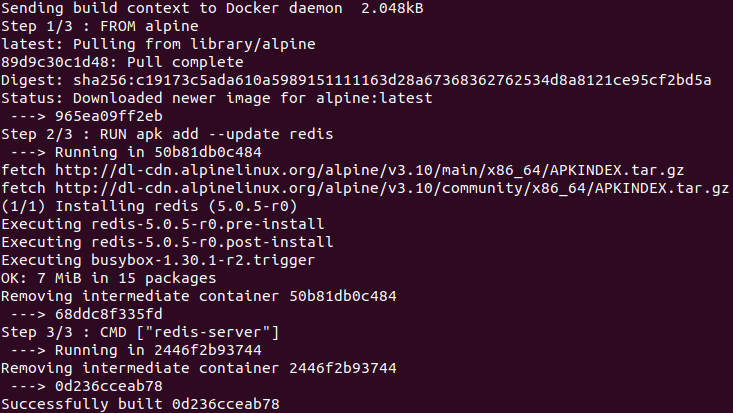

Creiamo un file Dockerfile all'interno di una nuova cartella
``` docker
# Usiamo un immagine esistente come base
FROM alpine # Specifico alpine come immagine di base (alpine è un OS unix-like)

# Scarichiamo ed installiamo le dipendenze
RUN apk add --update redis # Comando mandato ad alpine (apk = packet manager di alpine)

# Specifichiamo uno Startup command
CMD ["redis-server"]
```
Ora da terminale diamo il comando:
``` sh
docker build . # Trovandoci nella stessa cartella del Dockerfile
```



L'immagine è stata creata! Ora è possibile farla girare copiando l'id (ultima riga)
