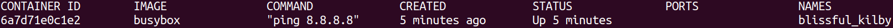
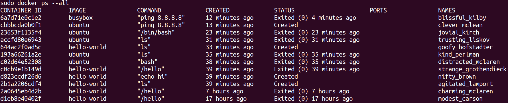
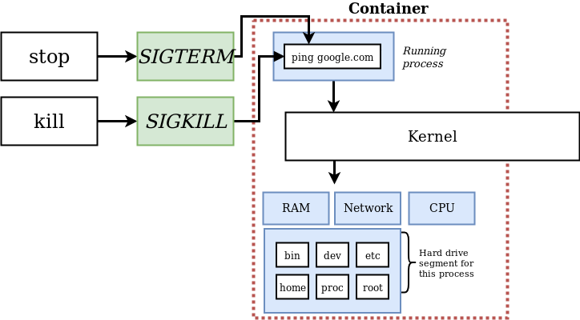

# Manipolare i container

## Creare e avviare un container
``` sh
> (sudo) docker run <nome_immagine> # Crea ed avvia il container usando l'immagine
```
È anche possibile fare un [override](https://it.wikipedia.org/wiki/Override) del comando eseguito all'avvio del container:
``` sh
> (sudo) docker run <nome_immagine> <optional_override_command> # All'avvio non uso il comando specificato nell'immagine
# Ad esempio:
> (sudo) docker run busybox ls # Crea l'immagine e fa vedere il File system del container
# NOTA: busybox combina diverse applicazioni standard Unix in un piccolo eseguibile
```
> Se provate `docker run hello-world ls` vi darà errore, perchè **nel container**, più precisamente nel suo FS, **non c'è** un eseguibile che renda sensato il comando `ls`

## Lista dei container attivi
``` sh
> (sudo) docker ps # Lista dei container che stanno girando sulla macchina
> (sudo) docker ps --all # Lista di tutti i container mai eseguiti ed anche in esecuzione
```
> Da qui notiamo una cosa: dopo aver eseguito il container hello-world se uso il comando senza `--all` non lista nessun container attivo, perchè **appena finisce l'esecuzione del comando il container smette di essere attivo**.<br>
Proviamo quindi a dare il comando `docker run busybox ping 8.8.8.8` e a ridare il comando `docker ps`... il risultato è diverso!




::: tip
Nel campo **NAMES** vi è un nome generato casualmente per identificare il container
:::

## Lifecycle: Ciclo di vita di un container


- Nella fase di **creazione** di un container il FS viene **caricato** nell' Hard Drive.
- Nella fase di **esecuzione** eseguo lo **Startup Command**
``` sh
> (sudo) docker create <optional_override_command># Crea il container e soprattutto ne stampa a video l'id
> (sudo) docker start -a <id> # Esegue lo Startup Command del container
```
::: tip
se eseguissimo `docker start` senza **-a** vedremmo a video solo l'id del container, `-a` quindi specifica a docker di far **ascoltare** al terminale l'output del container.
:::

### Restarting Stopped Containers
Quando un container è nello stato **Exited** (si vede dando `docker ps --all`) posso farlo ripartire per riusarlo tramite **docker start**, visto appena sopra.
::: warning
Nel caso in cui io faccio ripartire un container **non posso effettuare un Override** dello Startup command, essendo questo disponibile in **fase di creazione**.
:::

### Removing Stopped Containers
``` sh
> (sudo) docker system prune # Elimina tutti i container stoppati ed altre cose (l'avviso prima della conferma del comando è già dettagliata)
# NOTA: tra le altre cose si cancella anche la build cache (ovvero quella che chiamavo imageCache)
#       significa che le immagini scaricate da docker hub necessiteranno un altro download
```
::: tip
È bene sfruttare questo comando ogni tanto (dopo mesi/settimane)
:::

### Stopping Running Containers
``` sh
> (sudo) docker stop <id> # Do del tempo al container per fermarsi "con le buone"
> (sudo) docker kill <id> # Termina il processo immediatamente
```



::: tip
Se il container non risponde al comando stop, spesso va usato kill.<br>
Docker dopo **10 secondi** di attesa automaticamente esegue il comando `docker kill`

Esempio:<br>
Se io do il **SIGTERM** ad un container che sta pingando google, il container non risponderà al SIGTERM, essendo il comando `ping` non capace di reagire all'arrivo di quel segnale e finirà per essere necessario un **SIGKILL**.
:::

## Ottenere Log Outputs
Per vedere l'**output** di un docker container stoppato **senza farlo ripartire**:
``` sh
> (sudo) docker logs <id>
```

## Multi-command Containers (& -it)
A volte abbiamo la necessita di fornire ad un container (attivo), anche altri comandi **oltre a quello di startup**.<br>
Ad esempio in un container contenente **Redis**, che si compone di due applicativi (server e cli), ci serve quasi sicuramente fornire più comandi per fare interagire gli applicativi
``` sh
> (sudo) docker exec -it <container_id> <command> # Fornisce al container un comando da eseguire
```
> l'opzione `-it` permette di **dare un input** al container, senza di essa ad esempio il comando `docker exec <id> redis-cli` terminerebbe senza poter dare input alla console di redis.

> Ed è formato (e per cio riscrivibile come la somma dei due) da `-i` e `-t`, dove:
> 1. `-i` dice che ciò che scriviamo da deve passare al segnale **STDIN** del processo (vedi sotto).
> 2. `-t` si occupa di **formattare** decentemente il testo di risposta del container e dare anche degli **autocomplete**.

Ricordiamoci che docker gira su una **VM Linux**, i processi quindi comunicano tramite **segnali** come i 3 segnali rappresentati nel diagramma (**STDIN**, **STDOUT** e **STDERR**):


### Aprire un terminale fisso sul container
L'approccio visto sopra è valido, ma se dobbiamo dare molteplici comandi risulta scomodo... esiste quindi un modo per aprire un contatto fisso con il container:
``` sh{3}
> (sudo) docker exec -it <container_id> sh # Il comando 'sh' mi da un accesso completo alla shell (UNIX in questo caso) del container
# SE il container ne ha una...
# Oppure se è la prima esecuzione:
> (sudo) docker run -it <image_name> sh
# (Per uscire serve il comando di uscita previsto dalla shell)
```
Alternative possibili ad `sh` (Command Processors/[Shell](https://it.wikipedia.org/wiki/Shell_(informatica))):
1. `bash`
2. `powershell` ---> container windows :nauseated_face:
3. `zsh`
